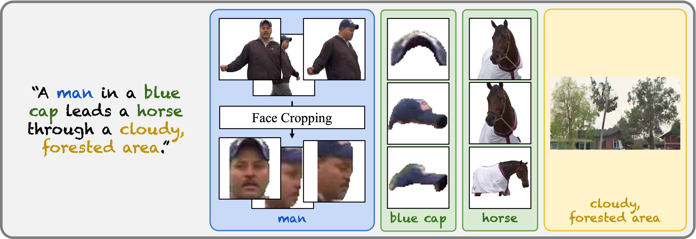
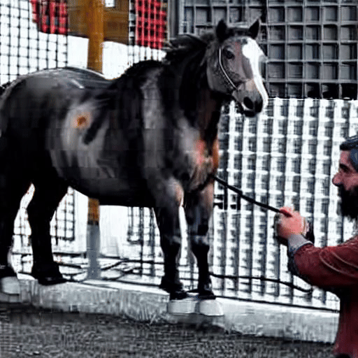
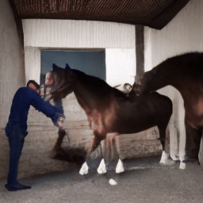
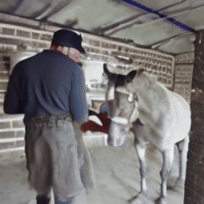
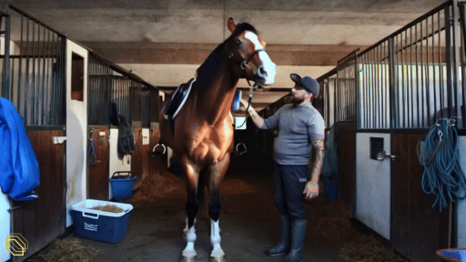
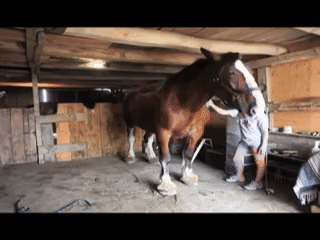

# MSRVTT-Personalization

**[Multi-subject Open-set Personalization in Video Generation](https://snap-research.github.io/open-set-video-personalization/)**
</br>
[Tsai-Shien Chen](https://tsaishien-chen.github.io/),
[Aliaksandr Siarohin](https://aliaksandrsiarohin.github.io/aliaksandr-siarohin-website/),
[Willi Menapace](https://www.willimenapace.com/),
[Yuwei Fang](https://yuwfan.github.io/),
[Kwot Sin Lee](https://www.linkedin.com/in/kwotsin/),
[Ivan Skorokhodov](https://skor.sh/),
[Kfir Aberman](https://kfiraberman.github.io/),
[Jun-Yan Zhu](https://www.cs.cmu.edu/~junyanz/),
[Ming-Hsuan Yang](https://faculty.ucmerced.edu/mhyang/),
[Sergey Tulyakov](http://www.stulyakov.com/)
</br>

[](https://arxiv.org/abs/2501.00000)
[](https://snap-research.github.io/open-set-video-personalization/)

In this paper, we introduce *MSRVTT-Personalization*, a new benchmark for the task of personalization. It aims at accurate subject fidelity assessment and supports various conditioning modes, including conditioning on face crops, single or multiple arbitrary subjects, and the combination of foreground objects and background.

We include the testing dataset and evaluation protocol in this repository. We show a test sample of *MSRVTT-Personalization* below:
<table class="center">
  <tr>
    <td width=38% style="border: none"></td>
    <td width=62% style="border: none"></td>
  </tr>
  <tr style="text-align: center;">
    <td width=38% style="border: none">Ground Truth Video</td>
    <td width=62% style="border: none">Personalization Annotations</td>
  </tr>
</table>
<sup>**We will remove video samples from Github / project webpage / technical presentation as long as you need it. Please contact tsaishienchen at gmail dot com for the request.</sup>

# Leaderboard
- *MSRVTT-Personalization* evaluates a model across five metrics:
  - Text similarity (Text-S)
  - Video similarity (Vid-S)
  - Subject similarity (Subj-S)
  - Face similarity (Face-S)
  - Dynamic degree (Dync-D)

- Quantitative evaluation:
  - Subject mode of *MSRVTT-Personalization* (condition on an entire subject image)
    | Method | Text-S | Vid-S | Subj-S | Dync-D |
    |--------|--------|-------|--------|--------|
    | [ELITE](https://github.com/csyxwei/ELITE)            | 0.245     | 0.620     | 0.359     | -         |
    | [VideoBooth](https://github.com/Vchitect/VideoBooth) | 0.222     | 0.612     | 0.395     | 0.448     |
    | [DreamVideo](https://github.com/ali-vilab/VGen)      | 0.261     | 0.611     | 0.310     | 0.311     |
    | *Video Alchemist*                                    | **0.269** | **0.732** | **0.617** | **0.466** |

  - Face mode of *MSRVTT-Personalization* (condition on a face crop image)
    | Method | Text-S | Vid-S | Face-S | Dync-D |
    |--------|--------|-------|--------|--------|
    | [IP-Adapter](https://github.com/tencent-ailab/IP-Adapter) | 0.251     | 0.648     | 0.269     | -         |
    | [PhotoMaker](https://github.com/TencentARC/PhotoMaker)    | **0.278** | 0.569     | 0.189     | -         |
    | [Magic-Me](https://github.com/Zhen-Dong/Magic-Me)         | 0.251     | 0.602     | 0.135     | 0.418     |
    | *Video Alchemist*                                         | 0.273     | **0.687** | **0.382** | **0.424** |

- Qualitative evaluation:
  - Subject mode of *MSRVTT-Personalization*
    <table class="center">
      <tr>
        <td width=100% colspan=5 style="border: none"></td>
      </tr>
      <tr style="text-align: center;">
        <td width=15.9%  style="border: none"></td>
        <td width=15.9%  style="border: none"></td>
        <td width=15.9%  style="border: none"></td>
        <td width=28.25% style="border: none"></td>
        <td width=21.2%  style="border: none"></td>
      </tr>
      <tr style="text-align: center;">
        <td width=15.9%  style="border: none"><a href="https://github.com/csyxwei/ELITE">ELITE</a></td>
        <td width=15.9%  style="border: none"><a href="https://github.com/Vchitect/VideoBooth">VideoBooth</a></td>
        <td width=15.9%  style="border: none"><a href="https://github.com/ali-vilab/VGen">DreamVideo</a></td>
        <td width=28.25% style="border: none"><em>Video Alchemist</em></td>
        <td width=21.2%  style="border: none">Ground Truth</td>
      </tr>
    </table>

  - Face mode of *MSRVTT-Personalization*
    <table class="center">
      <tr>
        <td width=100% colspan=5 style="border: none"></td>
      </tr>
      <tr style="text-align: center;">
        <td width=23.62% style="border: none"></td>
        <td width=13.3%  style="border: none"></td>
        <td width=13.3%  style="border: none"></td>
        <td width=23.62% style="border: none"></td>
        <td width=23.62% style="border: none"></td>
      </tr>
      <tr style="text-align: center;">
        <td width=23.62% style="border: none"><a href="https://github.com/tencent-ailab/IP-Adapter">IP-Adapter</a></td>
        <td width=13.3%  style="border: none"><a href="https://github.com/TencentARC/PhotoMaker">PhotoMaker</a></td>
        <td width=13.3%  style="border: none"><a href="https://github.com/Zhen-Dong/Magic-Me">Magic-Me</a></td>
        <td width=23.62% style="border: none"><em>Video Alchemist</em></td>
        <td width=23.62% style="border: none">Ground Truth</td>
      </tr>
    </table>

# Evaluation Protocol

To add

## Citation

If you find this project useful for your research, please cite our paper. :blush:

```bibtex
@inproceedings{chen2025videoalchemist,
  title   = {Multi-subject Open-set Personalization in Video Generation},
  author  = {Chen, Tsai-Shien and Siarohin, Aliaksandr and Menapace, Willi and Fang, Yuwei and Lee, Kwot Sin and Skorokhodov, Ivan and Aberman, Kfir and Zhu, Jun-Yan and Yang, Ming-Hsuan and Tulyakov, Sergey},
  journal = {arXiv preprint arXiv:2501.00000},
  year    = {2025}
}
```

## Contact Information
**Tsai-Shien Chen**: [tsaishienchen@gmail.com](mailto:tsaishienchen@gmail.com) 
